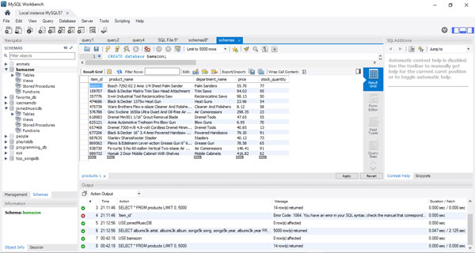
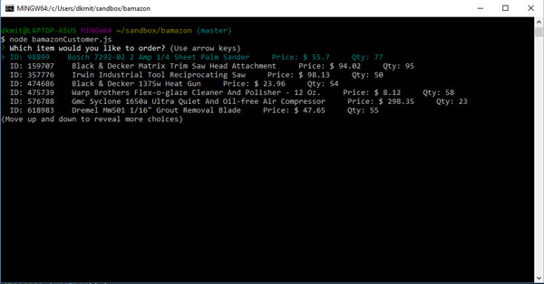
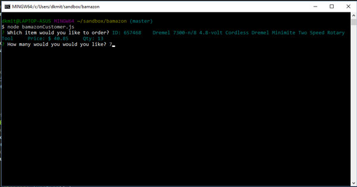
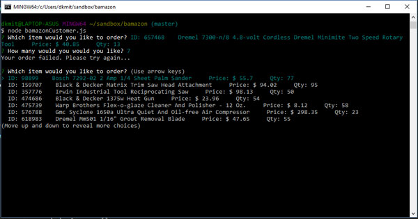

# Bamazon
create an Amazon-like storefront app that will take in orders from customers and deplete stock from the store's inventory.

## Screen Shots of Bamazon

database with products.

Showing server runnng with products displaying.

Showing products selected and requesting quantity.

Failed message after selected quantity.

This is an incomplete project that i would like to come back to and complete.